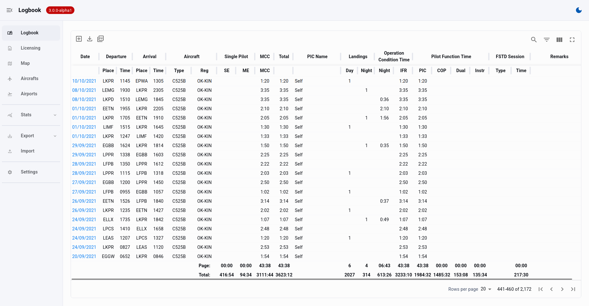
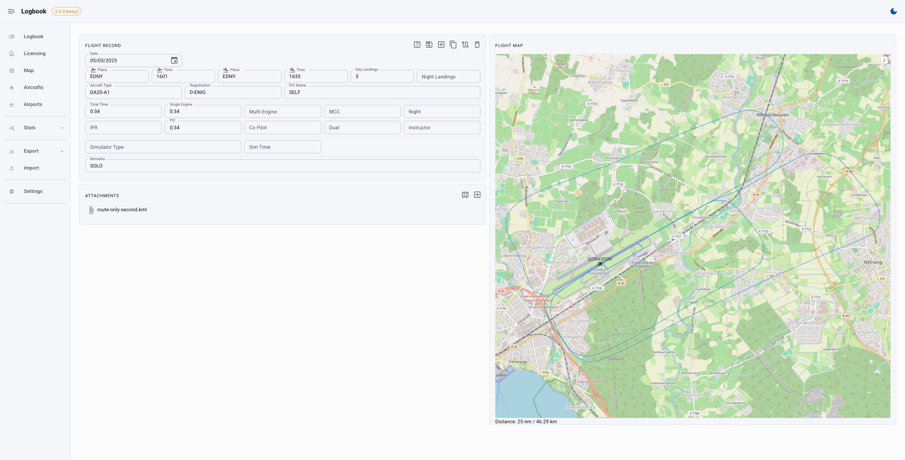
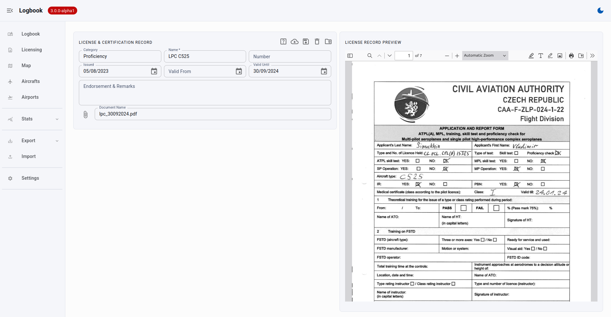
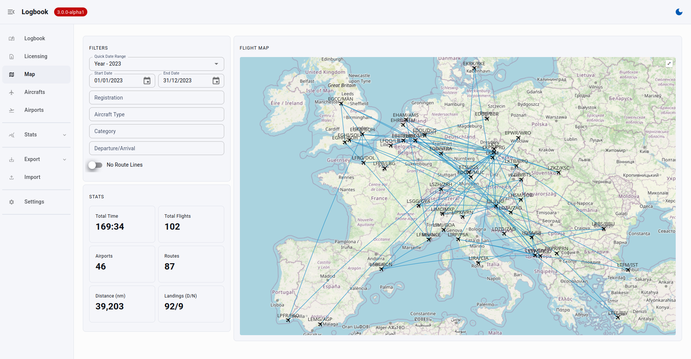
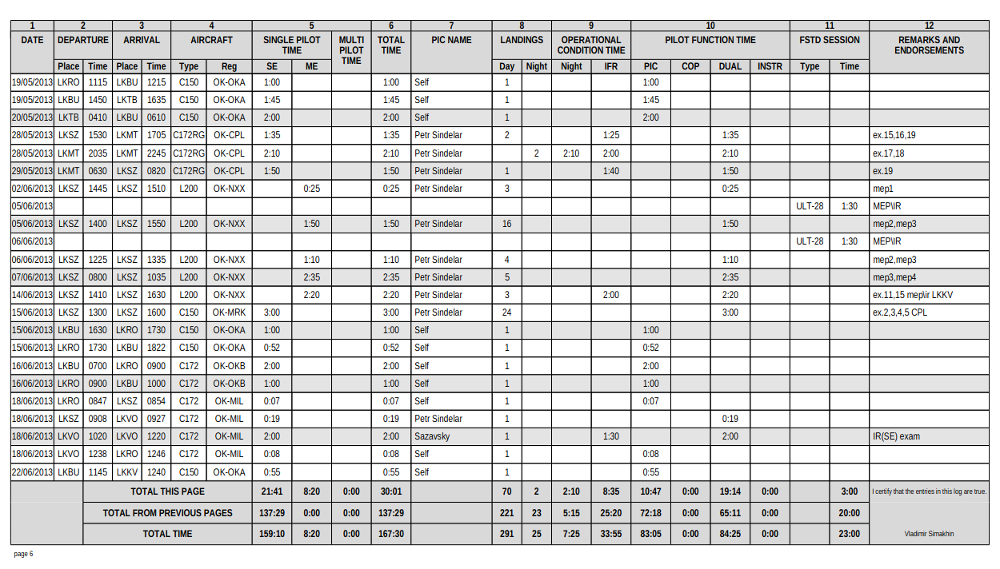
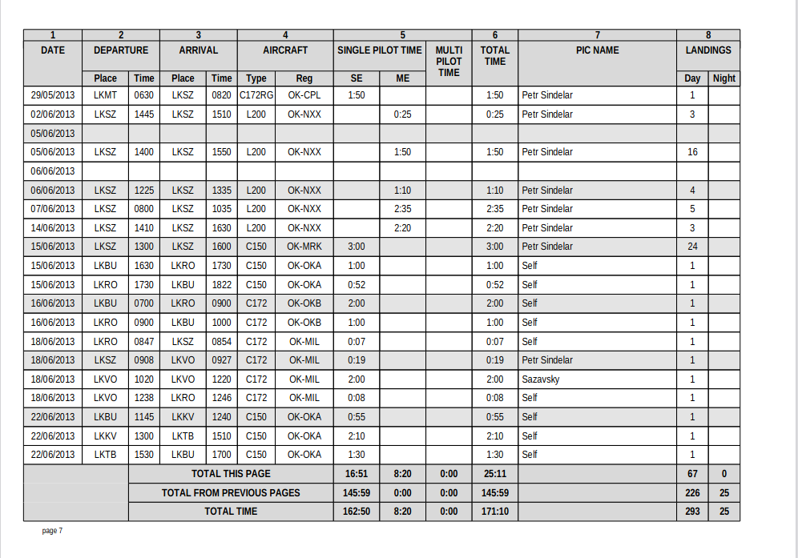
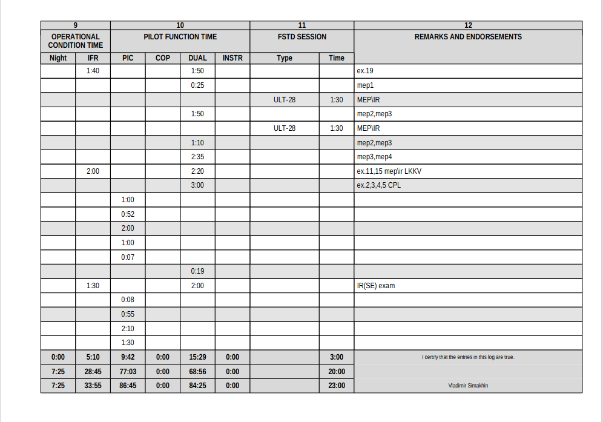
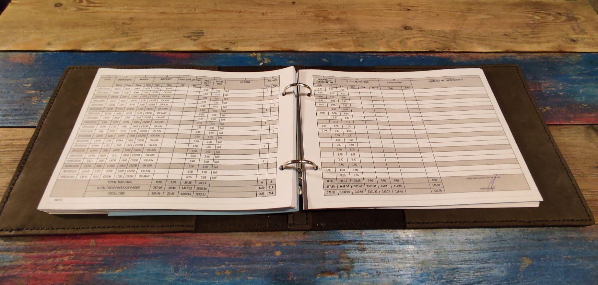
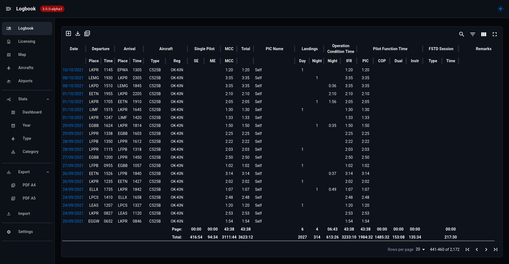
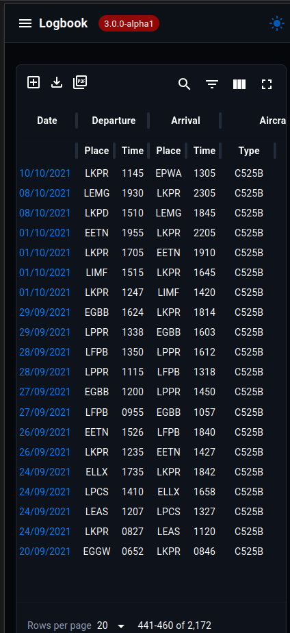

 
 
[](https://buymeacoffee.com/vsimakhin)


# Web-logbook

This is a simple, free and opensource EASA-style logbook application written in golang.

You can clone the repo and compile the binaries yourself, or just download the latest ones for your operating system from the [releases](https://github.com/vsimakhin/web-logbook/releases).

Once you start the app it automatically creates an SQLite local DB and starts listening on port 4000 by default. So you can open it in your standard web browser at http://localhost:4000

You also can easily export all flight records into EASA style pdf format, print it, sign and use it as a usual paper logbook.

# Changelog

## [2.42.0] - 30.08.2024

- Update: No longer shorten the remarks field for small screens if the option "Do not adjust logbook columns for small screens" is selected
- Fix: Recreate the database view during startup in case changes didn't propagate after a version change.

## [2.41.0] - 11.08.2024

- Update: Update go minor version (1.21.13) and related packages (bug and security fixes).
- Fix: Corrected a title for the login page.
- Fix: Fix the random order of the elements on Stats by Type/Class pages

## [2.40.0] - 10.07.2024

- Update: The page will no longer reload when saving a new flight record.
- Update: During validation, fields with correct values will no longer be highlighted in green. Only fields with incorrect values will be highlighted in red.
- New: Added a "Copy" button to the Flight Record page.
- Update: When the arrival or departure time is changed and the total time is recalculated, the other time fields will also be checked against the old total.

## [2.39.0] - 03.07.2024

- Fix: Incorrect night time calculation when flying inside the polar circle

The full changelog is [here](https://github.com/vsimakhin/web-logbook/blob/main/CHANGELOG.md)

# Usage

1. Download the latest release from https://github.com/vsimakhin/web-logbook/releases
1. Extract the archive to some folder/directory
1. Run:
  * Windows:
    * Double-click on the `web-logbook.exe` file. It will show you some warning about how unsafe it can be (need to solve it later), but just run it.
  * Linux/MacOS:
    * Open a terminal and navigate to the directory
    * Run `./web-logbook`
4. Open your browser, type http://localhost:4000 and the application is ready to use
  * *(first run)* Go to the `Settings->Airports` page and click on the `Update Airport DB` button
6. To close the application, use `Ctrl+C` in the terminal window or just close it

## CLI options
```sh
$ ./web-logbook -h
  -cert string
      certificate path (default "certs/localhost.pem")
  -disable-authentication
      Disable authentication (in case you forgot login credentials)
  -dsn string
      Data source name {sqlite: file path|mysql: user:password@protocol(address)/dbname?param=value} (default "web-logbook.sql")
  -enable-https
      Enable TLS/HTTPS
  -engine string
      Database engine {sqlite|mysql} (default "sqlite")
  -env string
      Environment {dev|prod} (default "prod")
  -key string
      private key path (default "certs/localhost-key.pem")
  -port int
      Server port (default 4000)
  -url string
      Server URL (default empty - the app will listen on all network interfaces)
  -version
      Prints current version
```

# Supported operating systems

Since it's written in Golang, it can run on any system after compiling the sources. Currently, on the [Release](https://github.com/vsimakhin/web-logbook/releases/latest) page, there are binaries available for Linux, MacOS, and Windows.


# Interface

* Logbook
  * Flight records with date filter and global search through all data
  * Quick export to PDF (A4, A5) and CSV/XLS
* Flight records
  * Flight data
  * Attachments for the flight records
  * Automatic night-time calculation
  * Map drawing and distance calculation for the flight record
* Licensing & Certification
  * List of licenses, certificates and endorsements
  * Document attachments and preview
  * Expiration time tracking
* Map
  * Map of the flights
  * Date filters
  * Routes and airports filters
  * Aircraft filters
* Statistics
  * Totals
  * By Year
  * By Month
  * By Aircraft
  * By Aircraft group/class
  * Limits (EASA flight time limitations)
* Export
  * Export to EASA PDF format (A4 and A5)
  * PDF export formats with custom title pages (for example, include your CV automatically)
  * Additional export formats (XLSX, CSV)
  * Adjustable settings for each export format
* Import
  * CSV support
  * Automatic WebLogbook profile load
* Settings
  * Owner name, license and address, signature for the PDF exports
  * Signature pad to automatically include signatures to the PDF exports
  * Enable/Disable authentication (in case you need to expose the app to the public internet)
  * Aircraft groups/classes
  * Global airport database
  * Your own custom airfields or heliports
  * Some interface settings

## Logbook


## Flight record


## Licensing & Certification


## Map


## Stats example


## Export


### A4


### A5



So in real life the logbook could look like


## Import


## Settings


## Dark mode


## Mobile friendly


# Airports Databases

The app supports 3 sources:
* https://github.com/mwgg/Airports/raw/master/airports.json - main JSON database of 28k+ airports.
* (default) https://github.com/vsimakhin/Airports/raw/master/airports.json - my local fork of the main JSON database,  to ensure that the app remains functional even if there are any breaking changes in the upstream.
* https://davidmegginson.github.io/ourairports-data/airports.csv - an alternate set of airports from https://ourairports.com/, which contains over 78k records, including small airfields and heliports. 

If you enable the `No ICAO codes filter` option, the app will ignore ICAO airport codes that contain numbers and dashes, which are not commonly used ICAO codes. By default, this option is unchecked, which makes the database slightly smaller and cleaner.

# Advanced configuration

## Docker

Check [readme](./docker/README.md) for dockerized app for more details.

## HTTPS enable

Since the app is running on `localhost` it's not possible to create a public certificate that would be valid by public CAs. As an option, you can create a self-signed certificate and add it to the root CA in your operating system. For that, you can use [`mkcert` tool](https://github.com/FiloSottile/mkcert).

* Open a terminal/console and navigate to the `web-logbook` directory
* Create a directory `certs`
* In this new directory run commands:
  * `mkcert -instal` - it will create a new local CA
  * `mkcert localhost` - it will generate a key(`localhost-key.pem`) and a certificate(`localhost.pem`)
* Now just run the Web Logbook App with the new parameter: `web-logbook --enable-https`

You don't need to install a new local CA in you system, but in this case, browser will always show you a warning message, that certificate is self-signed and not trusted.

Also, you can always generate your own certificate and key and store it in the different directories in your operating system. For that use `--key` and `--cert` parameters to specify the exact location.

## MySQL database

To store all data, you can use MySQL database. To get started, create a database and a user with access to it. On the first run, the application will create all necessary tables and views. If you want to migrate your data from SQLite to MySQL, you can use the export to CSV function first and then import from CSV.

The DSN format for MySQL connections 
```
user:password@protocol(address)/dbname?param=value
```

For example, 
```
./web-logbook -engine mysql -dsn "web-logbook-user:pwd@tcp(192.168.0.222)/web-logbook"
```

# New features/Issues

In case you'd like to add some other features to the logbook or you found a bug, please open an "issue" here https://github.com/vsimakhin/web-logbook/issues with a description. I cannot promise I'll implement it or fix it at a reasonable time but at least I can take a look.

<a href="https://www.buymeacoffee.com/vsimakhin" target="_blank"></a>

# Contributors

* [@Jacopx](https://github.com/Jacopx), [@dimoniet](https://github.com/dimoniet), [@maesteve](https://github.com/maesteve), [@ken340](https://github.com/ken340) - bug reports, testing, and new functionality suggestions

# Used libraries

* Adminkit.io https://adminkit.io (AdminKit PRO License Agreement for Hobby License - https://adminkit.io/licenses/)
* Bootstrap https://getbootstrap.com/
* Datatables https://datatables.net/
* Openlayers https://openlayers.org/
* Golang go-pdf https://github.com/go-pdf/fpdf
* Golang chi web-server https://github.com/go-chi/chi
* Golang Excelize https://github.com/xuri/excelize
* Chart.js https://www.chartjs.org/
* Date Range Picker https://www.daterangepicker.com/
* Signature Pad https://github.com/szimek/signature_pad
* PapaParse https://github.com/mholt/PapaParse
* arc.js https://github.com/springmeyer/arc.js
